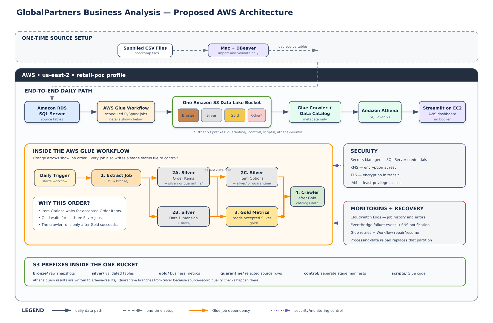
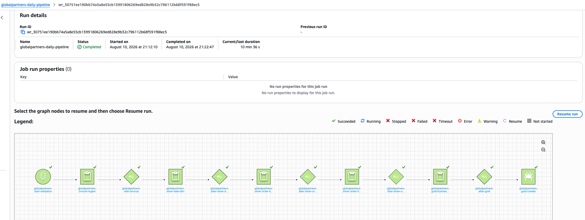

# GlobalPartners Business Analysis

AWS-based data engineering and analytics project using SQL Server source data, AWS Glue PySpark transformations, Amazon S3, Athena, and Streamlit.

## Project Objective

Build an end-to-end pipeline that creates a unified view of customer behavior and business performance across restaurant locations and ordering platforms.

The solution will support customer value analysis, RFM segmentation, churn indicators, sales trends, loyalty comparisons, location performance, and pricing or discount analysis where supported by the source data.

## Current Status

The AWS pipeline from RDS SQL Server through S3 Bronze, separate Silver transformations, Gold business metrics, Glue Data Catalog, and Athena has been built and validated end to end. The Glue Workflow completed all six actions successfully and passed same-date reload checks. Centralized failure notification and the Streamlit dashboard remain in progress.

## Implemented Pipeline

`CSV setup files → Amazon RDS for SQL Server → AWS Glue JDBC → AWS Glue PySpark → Amazon S3 Bronze Parquet`

## Project Plan

| Phase | Work | Status |
|---|---|---|
| 00 | Repository setup and source-file organization | Complete |
| 01 | Source profiling, integrity checks, keys, and relationships | Complete |
| 02 | AWS architecture, data model, solution design, and SME review | Complete |
| 03 | AWS infrastructure and SQL Server source setup | Complete |
| 04 | PySpark transformation pipeline, scheduling, encryption, and reload handling | In progress |
| 05 | Business metrics and analytical SQL queries | Complete |
| 06 | Streamlit dashboard | Not started |
| 07 | Testing, CI/CD, documentation, and walkthrough | Not started |

## Work Completed

### Source Analysis

- Created the repository structure and protected local source files with `.gitignore`.
- Created a reproducible Python environment.
- Built scripts for source profiling, candidate-key testing, relationship validation, and exception analysis.
- Verified the supplied schemas, row counts, missing values, candidate keys, relationships, and date coverage.
- Generated local reports and documented the profiling findings.

### Architecture and AWS Foundation

- Designed an AWS-based medallion architecture and received SME approval on August 7, 2026.
- Created an encrypted S3 data lake with public-access blocking, versioning, project tags, and separate data-layer prefixes.
- Created the project VPC networking configuration, security group, S3 gateway endpoint, and Secrets Manager interface endpoint.
- Created an encrypted Amazon RDS for SQL Server instance with automated backups and RDS-managed credentials.
- Configured restricted DBeaver access from macOS.
- Created the Glue IAM role and tested an SSL-enabled JDBC connection from AWS Glue to SQL Server.

### SQL Server Source

- Created the `globalpartners` database and three typed source tables.
- Prepared SQL Server-compatible load files without modifying the original CSVs.
- Loaded and validated 396,901 source rows:
  - `dbo.date_dim`: 365 rows
  - `dbo.order_items`: 203,519 rows
  - `dbo.order_item_options`: 193,017 rows

### Bronze Ingestion

- Built and deployed the `globalpartners-bronze-ingest` Glue PySpark job.
- Used complete dated snapshots because the source tables do not all contain reliable change-tracking fields.
- Added source, processing-date, run, and ingestion-time audit fields.
- Wrote Snappy-compressed Parquet files to table-specific Bronze paths.
- Created JSON control documents containing run status, row counts, and output locations.
- Confirmed that all Bronze row counts matched SQL Server.
- Reran the same processing date and confirmed that current snapshot objects were replaced while the row counts remained unchanged.
- Retained earlier object versions through S3 versioning for recovery.

## Findings to Date

### Source Data

- `order_items.csv` contains 203,519 rows, matching the documented count.
- `order_item_options.csv` contains 193,017 rows, matching the documented count.
- `date_dim.csv` contains 365 dates covering only calendar year 2023.
- Order activity spans April 21, 2020 through February 21, 2024.
- Every 2023 order-item row matches the supplied date dimension.
- Populated `lineitem_id` values are unique, but one value is missing.
- The options source contains 2,299 exact repeated rows.
- No supplied option-column combination uniquely identifies every option row.
- Twenty-eight option rows reference 14 orders that are absent from `order_items`.
- `user_id` is missing from 8.75% of order-item rows.
- `printed_card_number` is missing from 77.36% of order-item rows.

### Bronze Validation

| Source Table | SQL Server Rows | Bronze Rows | Match |
|---|---:|---:|---|
| `dbo.date_dim` | 365 | 365 | Yes |
| `dbo.order_items` | 203,519 | 203,519 | Yes |
| `dbo.order_item_options` | 193,017 | 193,017 | Yes |

The reload test used the same processing date and replaced 20 current Spark output objects in each table partition. The replacement snapshot produced the same row counts and did not create a second logical copy of the data.

## Approved AWS Architecture

The approved design uses Amazon RDS for SQL Server as the source. An AWS Glue Workflow will coordinate the Bronze ingestion job, separate Silver PySpark jobs, and the Gold analytical job.

The processing flow is:

1. Extract complete source snapshots from SQL Server into S3 Bronze.
2. Clean and validate each source table through separate Silver jobs.
3. Route rejected records to the S3 quarantine area.
4. Create business-facing Gold tables.
5. Register Gold tables through an AWS Glue crawler and Data Catalog.
6. Query the Gold layer with Athena.
7. Display final metrics in a Streamlit dashboard hosted temporarily on Amazon EC2.

The design includes encrypted storage, SSL database connectivity, managed credentials, scheduling, monitoring, failure notification, and processing-date reload support.

## End-to-End Pipeline Validation

The complete AWS Glue Workflow was validated on August 10, 2026. The workflow
ran the Bronze ingestion, three dependent Silver transformations, Gold business
metrics job, and Gold crawler in sequence.

- All six workflow actions succeeded with no failures or timeouts.
- The run completed in approximately 10 minutes 37 seconds.
- Each downstream step started only after its upstream dependency succeeded.
- A same-date reload replaced the existing Bronze, Silver, quarantine, and Gold
  objects before writing.
- Silver row-count checks and all six Gold revenue reconciliations passed after
  replacement.
- The daily 11:00 UTC schedule is configured and remains inactive while the
  portfolio source is unchanged for cost control.

The validated workflow produced 131,328 Gold orders, 203,518 Gold order lines,
20,174 customer profiles, and $1,863,974.28 in reconciled order revenue.

## Open Decisions

The following rules must be resolved or clearly documented during Silver and Gold development:

- Whether `user_id` should be treated as the requested customer identifier.
- Whether `restaurant_id` should be treated as the requested location identifier.
- Whether the supplied date dimension should remain limited to 2023 or be supplemented for the full order history.
- Whether exact repeated option rows represent duplicates or valid repeated selections.
- How orphan option records should be handled beyond quarantine and reporting.
- How missing customer identifiers should affect customer-level metrics.
- How profitability and discount analysis should be handled without documented product-cost or explicit discount fields.
- What thresholds should be used for RFM and churn indicators.

## Documentation

- [Architecture overview](architecture/architecture-overview.md)
- [Solution design](docs/solution-design.md)
- [Source analysis](docs/source-analysis.md)
- [Learning notes](learning-notes/)

## Current Focus

Define and build separate Silver PySpark jobs for `date_dim`, `order_items`, and `order_item_options`. The Silver layer will apply data types, quality flags, and quarantine rules while keeping each table independently controllable.