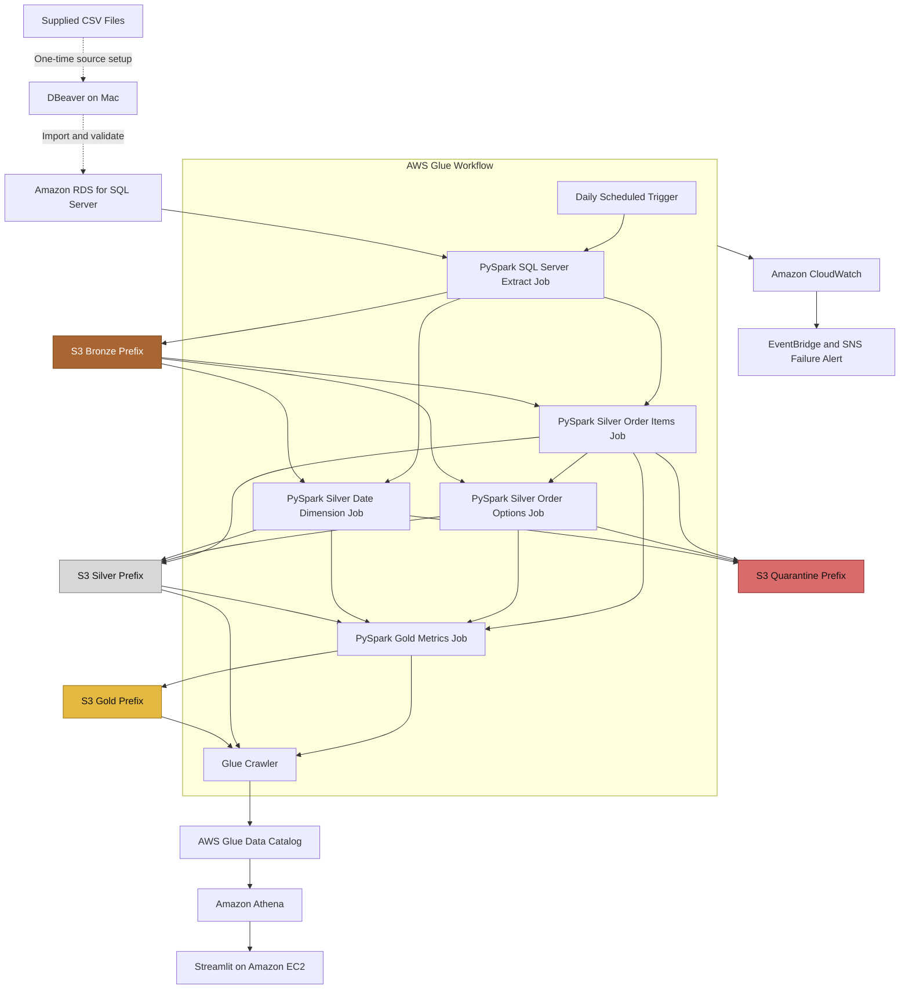

# Proposed AWS Architecture

**Status:** Draft for SME review  
**AWS Region:** `us-east-2`

## Objective

Build a scheduled AWS pipeline that reads SQL Server source tables, preserves the extracted data, applies PySpark transformations, and creates business-ready tables for Athena and Streamlit.

The design uses a Bronze, Silver, and Gold data model with individual Silver jobs for better control.

## Architecture Diagram



## Why AWS Glue Workflow

AWS Glue Workflow is proposed because the processing sequence consists primarily of dependent Glue PySpark jobs and a Glue crawler.

The workflow provides:

- A daily schedule
- Job dependencies
- A visual run graph
- Job and crawler status
- Conditional triggers
- Workflow history
- Repair and resume from a failed node

Glue Workflow is not required for every AWS pipeline. It is a good fit here because it keeps the related Glue processing components together without adding a separate orchestration service.

## Source Setup

The supplied data currently exists as three CSV files.

During one-time project setup, DBeaver will be used to:

1. Connect from the Mac to Amazon RDS for SQL Server.
2. Create the SQL Server tables.
3. Import the supplied CSV records.
4. Run T-SQL validation queries.
5. Confirm source schemas and row counts.

The SQL Server tables are:

- `order_items`
- `order_item_options`
- `date_dim`

After setup, the scheduled pipeline reads from SQL Server. DBeaver is not part of the daily pipeline.

SQL Server Management Studio, Docker, and a Windows virtual machine are not required.

## Medallion Data Layers

The project uses one encrypted S3 bucket with logical prefixes.

Proposed bucket name:

```text
globalpartners-data-jenny
```

The name must be checked for global availability before creation.

Proposed structure:

```text
s3://globalpartners-data-jenny/
    bronze/
    silver/
    gold/
    quarantine/
    control/
    scripts/
    athena-results/
```

These are S3 prefixes displayed as folders in the AWS console. They are not separate buckets.

### Bronze

Purpose:

Preserve each extracted SQL Server snapshot before applying business rules.

Written by:

`extract_sql_server_to_bronze.py`

Proposed paths:

```text
bronze/order_items/processing_date=YYYY-MM-DD/workflow_run_id=<run-id>/
bronze/order_item_options/processing_date=YYYY-MM-DD/workflow_run_id=<run-id>/
bronze/date_dim/processing_date=YYYY-MM-DD/workflow_run_id=<run-id>/
```

Bronze retains the extracted source records and adds only technical run metadata.

### Silver

Purpose:

Create validated and standardized source-level tables.

Silver uses individual jobs so each table has separate rules, logs, failures, and reload control.

Proposed jobs:

```text
transform_order_items_silver.py
transform_order_item_options_silver.py
build_date_dimension_silver.py
```

Proposed paths:

```text
silver/order_items/processing_date=YYYY-MM-DD/
silver/order_item_options/processing_date=YYYY-MM-DD/
silver/date_dim/processing_date=YYYY-MM-DD/
```

### Quarantine

Purpose:

Preserve records that fail approved Silver rules.

Proposed paths:

```text
quarantine/order_items/processing_date=YYYY-MM-DD/
quarantine/order_item_options/processing_date=YYYY-MM-DD/
quarantine/date_dim/processing_date=YYYY-MM-DD/
```

Examples of possible quarantine reasons include:

- Missing required key
- Invalid data type
- Invalid date
- Missing parent order
- Missing parent order item

Exact repeated option handling still requires approval.

Quarantine branches from the Silver jobs because Silver is where record-level quality rules are applied.

### Gold

Purpose:

Create business-ready metric tables.

Written by:

`build_business_metrics_gold.py`

Proposed paths:

```text
gold/customer_daily_value/as_of_date=YYYY-MM-DD/
gold/customer_rfm_snapshot/as_of_date=YYYY-MM-DD/
gold/customer_churn_indicator/as_of_date=YYYY-MM-DD/
gold/sales_daily/as_of_date=YYYY-MM-DD/
gold/sales_monthly/as_of_date=YYYY-MM-DD/
gold/loyalty_performance/as_of_date=YYYY-MM-DD/
gold/location_performance/as_of_date=YYYY-MM-DD/
gold/discount_effectiveness/as_of_date=YYYY-MM-DD/
```

Gold reads only approved Silver data.

Gold calculation failures stop the job rather than sending records to a second quarantine process. A Gold failure may indicate that a Silver validation rule needs to be corrected.

## Glue Workflow Sequence

### 1. Scheduled Trigger

Starts the workflow daily.

The workflow can also be started manually for testing, backfills, or reloads.

### 2. SQL Server Extract Job

Script:

```text
glue/jobs/extract_sql_server_to_bronze.py
```

Responsibilities:

- Connect to SQL Server through JDBC
- Extract all three source tables
- Add technical run metadata
- Write the Bronze snapshots
- Record source and output row counts

### 3. Silver Order Items Job

Script:

```text
glue/jobs/transform_order_items_silver.py
```

Responsibilities:

- Parse the order timestamp
- Parse prices and quantities
- Standardize boolean values
- Validate required columns
- Validate order and line-item identifiers
- Write accepted rows to Silver
- Write rejected rows to quarantine
- Reconcile input and output counts

### 4. Silver Date Dimension Job

Script:

```text
glue/jobs/build_date_dimension_silver.py
```

Responsibilities:

- Parse `date_key`
- Validate date uniqueness
- Validate calendar fields
- Assess date-range coverage
- Apply the approved date-extension rule
- Write accepted rows to Silver
- Write rejected rows to quarantine

This job can run in parallel with the Silver order-items job.

### 5. Silver Order Options Job

Script:

```text
glue/jobs/transform_order_item_options_silver.py
```

Responsibilities:

- Parse option prices and quantities
- Validate required fields
- Compare option records with accepted Silver order items
- Identify orphan records
- Apply the approved repeated-row rule
- Write accepted rows to Silver
- Write rejected rows to quarantine
- Reconcile input and output counts

This job runs after the Silver order-items job because an option must match an accepted parent order item.

### 6. Gold Metrics Job

Script:

```text
glue/jobs/build_business_metrics_gold.py
```

Responsibilities:

- Join the Silver tables
- Calculate item and option revenue
- Calculate daily Customer Lifetime Value
- Create customer value groups
- Calculate approved RFM measures
- Create churn indicators
- Create sales summaries
- Compare loyalty performance
- Calculate restaurant performance
- Analyze discount effectiveness
- Write the Gold tables

The Gold job starts only after all three Silver jobs succeed.

### 7. Glue Crawler

The crawler scans the completed Silver and Gold paths.

It updates the Glue Data Catalog with:

- Table names
- Column names
- Data types
- Parquet locations
- Available partitions

The crawler does not move or transform data.

It runs after the Gold job so it catalogs the completed Silver and Gold outputs together.

The Gold job reads Silver Parquet directly from its S3 paths, so it does not need the crawler to run first.

## Scheduling

The Glue Workflow uses a scheduled start trigger.

The final schedule time will be configurable.

Manual workflow runs will support:

- Initial testing
- Historical backfills
- Failed-date reloads
- Controlled reprocessing

## Failure and Reload Handling

### Automatic Retry

Each Glue job will use a limited retry count for temporary failures.

### Workflow Failure

If a job fails after its retries:

1. The workflow stops before dependent jobs run.
2. Glue records the failed job and workflow state.
3. CloudWatch retains the logs.
4. EventBridge captures the Glue job failure event.
5. SNS sends a failure notification.
6. Previously successful Gold data remains available.

### Workflow Repair

AWS Glue supports repairing and resuming a workflow from a failed node.

Because the Silver tables use separate jobs, the affected table can be rerun without combining every Silver transformation into one script.

### Manual Reload

A full processing date can also be rerun manually.

The reload uses:

- The same processing date
- A new workflow run ID
- The same PySpark rules

Silver and Gold processing-date partitions are replaced rather than appended during a successful reload. This prevents double-counting.

## Run Manifest

Each workflow run writes a JSON manifest under:

```text
control/processing_date=YYYY-MM-DD/workflow_run_id=<run-id>/manifest.json
```

The manifest records:

- Processing date
- Workflow run ID
- Current status
- Bronze source paths
- Source row counts
- Silver accepted counts
- Quarantine counts
- Repeated-row counts
- Gold output counts
- Start and completion times
- Error details

The manifest provides a persistent record after Glue workflow history expires.

## Data Catalog and Athena

The Silver and Gold data is stored as Parquet.

The Glue Crawler records the S3 schemas and partitions in the Glue Data Catalog.

Athena uses the Data Catalog to query the Parquet files with SQL.

Athena does not store another copy of the data.

## Streamlit

Streamlit will run directly on a small Amazon EC2 instance using Python.

The application will:

- Use the EC2 instance role for AWS access
- Submit queries to Athena
- Read approved Gold results
- Display the required dashboards

Docker, Amazon ECR, and Amazon ECS are not required.

EC2 is proposed because the dashboard remains AWS-hosted without adding container services. The instance can be stopped when it is not needed.

## Encryption and Access

- RDS storage will use AWS KMS encryption.
- SQL Server credentials will be stored in Secrets Manager.
- DBeaver access will be limited to the approved developer IP address.
- Glue will connect through an AWS Glue JDBC connection.
- S3 will block public access.
- S3 objects will use SSE-KMS.
- Glue jobs and logs will use a Glue security configuration.
- IAM roles will use least-privilege permissions.
- The EC2 instance will use an IAM role for Athena and S3 access.
- Streamlit will use HTTPS for the final deployment.

## Monitoring

CloudWatch will retain:

- Glue job logs
- Workflow status
- Job duration
- Error messages
- Data-quality counts

EventBridge will match failed Glue job events and send them to an SNS notification topic.

## Cost and Performance

The design is based on the supplied data volume and daily schedule.

Cost controls include:

- A small project-sized RDS configuration
- Glue jobs that run only when triggered
- Parquet for reduced Athena data scanning
- One S3 bucket with organized prefixes
- Limited log retention
- EC2 stopped when the dashboard is not needed
- Final cleanup instructions

The initial pipeline does not require streaming or CDC.

If the source volume or frequency increases significantly, incremental extraction can be evaluated later.

## Decisions Requiring Confirmation

1. Is `user_id` the approved customer identifier?
2. Should rows without `user_id` remain in sales metrics but be excluded from customer metrics?
3. Is `restaurant_id` the approved location identifier?
4. How should the 2,299 exact repeated option rows be handled?
5. Should the 28 orphan option rows be quarantined?
6. How should the missing `lineitem_id` be handled?
7. Should the date dimension be extended for the full order history?
8. How should profitability be addressed without product-cost data?
9. What lookback period should be used for RFM?
10. What inactivity threshold should define churn risk?
11. Is EC2 acceptable for hosting the Streamlit dashboard?

## References

- [AWS Glue workflow overview](https://docs.aws.amazon.com/glue/latest/dg/workflows_overview.html)
- [AWS Glue triggers](https://docs.aws.amazon.com/glue/latest/dg/about-triggers.html)
- [Creating an AWS Glue workflow](https://docs.aws.amazon.com/glue/latest/dg/creating_running_workflows.html)
- [Repairing and resuming a Glue workflow](https://docs.aws.amazon.com/glue/latest/dg/resuming-workflow.html)
- [AWS Glue JDBC connections](https://docs.aws.amazon.com/glue/latest/dg/aws-glue-programming-etl-connect-jdbc-home.html)
- [AWS Glue Spark and PySpark jobs](https://docs.aws.amazon.com/glue/latest/dg/spark_and_pyspark.html)
- [AWS Glue events in EventBridge](https://docs.aws.amazon.com/eventbridge/latest/ref/events-ref-glue.html)