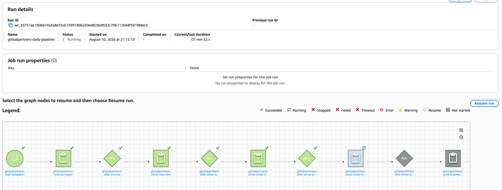

# AWS Glue Workflow Orchestration

## Objective

Coordinate the Bronze, Silver, Gold, and catalog steps as one managed AWS Glue
pipeline instead of running each job separately.

## Workflow Design

The workflow uses one scheduled starting trigger and conditional triggers that
wait for the preceding job to succeed:

1. Bronze SQL Server ingestion
2. Silver date dimension
3. Silver order items
4. Silver order item options
5. Gold business metrics
6. Gold Data Catalog crawler

The schedule is configured for 11:00 UTC each day. It remains inactive outside
project validation to avoid processing an unchanged source unnecessarily.

## Validation

The end-to-end workflow completed successfully on August 10, 2026. All five
Glue jobs and the crawler succeeded, with no failed, stopped, timed-out, or
errored actions.

The run also validated same-date reload behavior. Before writing, each job
deleted the existing target objects for the processing date and replaced them.
The final row counts and revenue reconciliations remained unchanged.

## Failure Behavior

Each downstream trigger requires a successful upstream job. If a job fails, the
remaining dependent jobs do not run. The failed node can then be investigated
and the workflow resumed or the processing date reloaded after correction.
