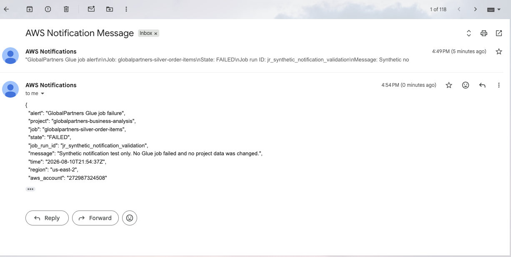

# Failure Notifications and Recovery

## Objective

Notify the project owner when a Glue job or crawler fails and provide a defined
recovery process for incomplete workflow runs.

## Notification Flow

Amazon EventBridge monitors state-change events from the five project Glue jobs
and the Gold crawler. Matching failure events are sent to the
`globalpartners-pipeline-alerts` SNS topic, which delivers an email alert.

The job rule monitors `FAILED`, `TIMEOUT`, and `STOPPED` states. The crawler rule
monitors the `Failed` state. Both rules are enabled and limited to the named
GlobalPartners resources.

## Validation

The EventBridge patterns were tested with representative job and crawler events.
A synthetic job-failure event was then sent through the actual EventBridge rule,
SNS topic, and confirmed email subscription. The alert was delivered without
running or failing a Glue job, and the rule was restored to AWS Glue events only
after the test.

## Recovery Approach

If a workflow job fails, its success trigger does not start the downstream job.
The failure alert identifies the job, state, run ID, time, region, and AWS
account. After correcting the cause, the workflow can be resumed from an
attempted node or the processing date can be reloaded.

Each ETL job replaces the target objects for its processing date before writing,
so a controlled reload does not append duplicate snapshot data. Row-count and
revenue reconciliation checks are rerun after processing.
